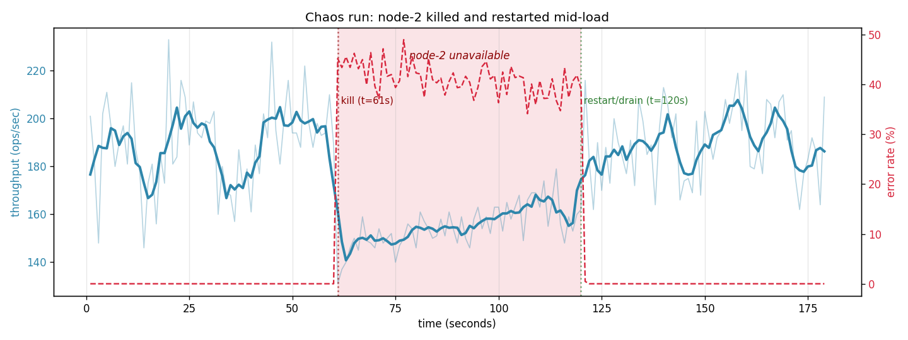
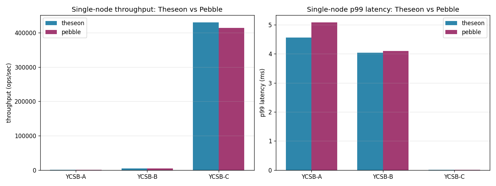
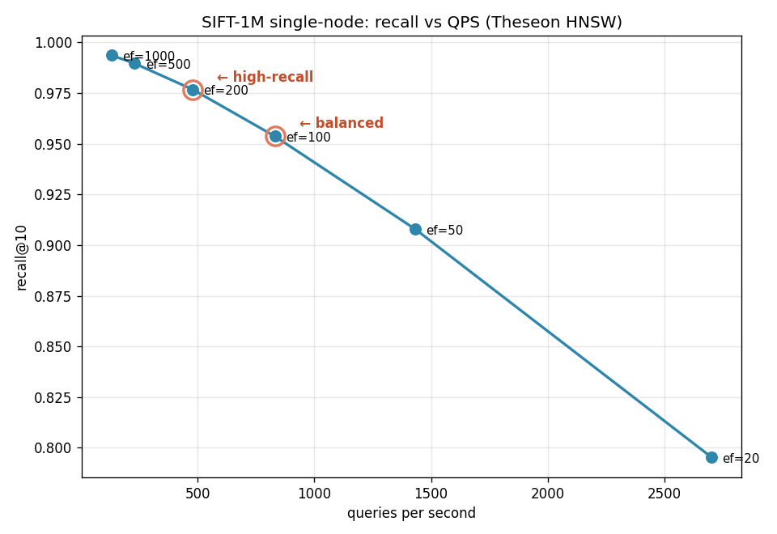

# Theseon

[](https://github.com/ulixert/theseon/actions/workflows/ci.yml)
[](https://go.dev/)
[](LICENSE)

A distributed LSM-tree storage engine with native vector search, built from scratch in Go.

Every core component — skip list, WAL, SSTable format, bloom filter, merge iterator, leveled compaction, snapshot
isolation, optimistic transactions — is hand-built. The distributed layer — consistent hashing, hybrid logical clocks,
SWIM gossip, quorum coordination, hinted handoff, merkle-tree anti-entropy — is equally from scratch. The vector search
layer — HNSW index, binary vector encoding, snapshot persistence, metadata filtering, distributed fan-out — is built on
the same foundation: vectors are regular KV entries, so replication and repair come for free. Only gRPC and protobuf use
external libraries.

> "Theseon" comes from the Greek _Theseion_ — the Temple of Hephaestus in Athens, one of the best-preserved ancient
> structures. It also evokes Theseus navigating the labyrinth, which is roughly what HNSW does: traversing layers of
> connections to find nearby vectors.

---

### 📊 [Benchmarking Theseon: KV, Cluster, Chaos, and HNSW on SIFT-1M](https://ulixert.github.io/posts/theseon-benchmarks/)

The latest post in the series. Four benchmark harnesses, five charts, and a debugging story.

- **Single-node**: Theseon matches Pebble on read throughput (~430K ops/sec) under equal cache budgets.
- **Cluster & chaos**: 3-node cluster sustains ~1.7K ops/sec on read-heavy workloads at N=3/W=2/R=2, and errors return to 0% within ~1 s of a killed-and-restarted node.
- **Vector**: HNSW on SIFT-1M hits **95% recall@10 at ~830 QPS**, with SIMD identified as the next major bottleneck.

<p align="center">
  
</p>

<p align="center">
  
  
</p>

See the [full post](https://ulixert.github.io/posts/theseon-benchmarks/) for methodology, the (3,1,3) null-result debugging story, and what I'd do next. Harnesses live in [`benchmarks/`](benchmarks/README.md) and are reproducible end-to-end.

---

## Blog Posts

1. [Building Theseon: A Distributed LSM Storage Engine from Scratch in Go](https://ulixert.github.io/posts/building-theseon/)
2. [The Storage Foundation: Memtable, WAL, and SSTables](https://ulixert.github.io/posts/theseon-storage-foundation/)
3. [Sequence Numbers, the Merge Iterator, and Wiring It All Together](https://ulixert.github.io/posts/theseon-wiring-it-together/)
4. [Making the Engine Self-Maintaining: Compaction, Caching, and Durability](https://ulixert.github.io/posts/theseon-self-maintaining/)
5. [Snapshots, Transactions, and the Art of Not Blocking Writers](https://ulixert.github.io/posts/theseon-mvcc-transactions/)
6. [Who's Alive? Building SWIM Failure Detection from Scratch](https://ulixert.github.io/posts/theseon-swim-protocol/)
7. [Quorum Reads, Quorum Writes, and the Repair That Follows](https://ulixert.github.io/posts/theseon-quorum-coordinator/)
8. [Buffering Writes for Dead Replicas: Hinted Handoff](https://ulixert.github.io/posts/theseon-hinted-handoff/)
9. [Building HNSW from Scratch: Graph Construction, Beam Search, and What Recall Actually Measures](https://ulixert.github.io/posts/theseon-hnsw-scratch/)
10. [Making Vectors Durable: KV Integration, Snapshot Persistence, and the Bugs Along the Way](https://ulixert.github.io/posts/theseon-vector-kv-integration/)
11. [Fan-Out, Merge, Repair: Distributed Vector Search](https://ulixert.github.io/posts/theseon-distributed-vector-search/)
12. [Starting, Joining, Activating: The Node Orchestrator](https://ulixert.github.io/posts/theseon-node-orchestrator/)
13. [Benchmarking Theseon: KV, Cluster, Chaos, and HNSW on SIFT-1M](https://ulixert.github.io/posts/theseon-benchmarks/)


## Getting Started

```go
package main

import "github.com/ulixert/theseon/db"

func main() {
	d, err := db.Open(db.DefaultOptions("./data"))
	if err != nil {
		panic(err)
	}
	defer d.Close()

	// Basic operations
	_ = d.Put([]byte("hello"), []byte("world"))

	val, found := d.Get([]byte("hello"))
	// val.Data = []byte("world"), found = true

	_ = d.Delete([]byte("hello"))

	// Point-in-time snapshots
	snap := d.GetSnapshot()
	defer snap.Close()
	val, found = snap.Get([]byte("hello")) // reads at snapshot time

	// Optimistic transactions
	tx := d.BeginTransaction()
	v, _ := tx.Get([]byte("counter"))
	tx.Put([]byte("counter"), append(v.Data, []byte("+1")...))
	if err := tx.Commit(); err == db.ErrConflict {
		// another writer modified "counter" — retry
	}

	// Iteration
	iter := d.Scan()
	defer iter.Close()
	for iter.IsValid() {
		// use kv.UserKey(iter.Key()) for the user key
		iter.Next()
	}
}
```

### Vector Search

```go
package main

import (
	"github.com/ulixert/theseon/db"
	"github.com/ulixert/theseon/vector"
)

func main() {
	d, _ := db.Open(db.DefaultOptions("./data"))
	defer d.Close()

	vs, _ := vector.NewVectorStore(d, vector.VectorStoreConfig{})
	defer vs.Close()

	// Create a collection
	vs.CreateCollection("embeddings", vector.CollectionConfig{
		Dim:         4,
		Metric:      vector.MetricCosine,
		M:           16,
		EfConstruct: 200,
		EfSearch:    50,
		MaxVectors:  1_000_000,
	})

	// Insert vectors (UUIDs as IDs, optional metadata)
	id := [16]byte{1, 2, 3, 4, 5, 6, 7, 8, 9, 10, 11, 12, 13, 14, 15, 16}
	vs.Put("embeddings", id, []float32{0.1, 0.2, 0.3, 0.4}, vector.Metadata{
		"label": "example",
		"score": 0.95,
	})

	// Search for nearest neighbors
	results, _ := vs.Search("embeddings", []float32{0.1, 0.2, 0.3, 0.4}, 10, nil)
	// results[0].ID, results[0].Distance, results[0].Metadata

	// Delete
	vs.Delete("embeddings", id)
}
```

Vectors are stored as regular KV entries — they survive restarts via WAL replay and reuse the same quorum
replication, hinted handoff, and anti-entropy paths as the rest of the KV engine.

### Distributed search via gRPC

The same API is exposed over gRPC. A client connects to **any** node — that node becomes the coordinator, hashes the
collection name to the ring, fans out to all readable replicas, and merges results with exact reranking:

```go
import (
    "google.golang.org/grpc"
    "google.golang.org/grpc/credentials/insecure"
    pb "github.com/ulixert/theseon/proto/theseonpb"
)

conn, _ := grpc.NewClient("localhost:50051",
grpc.WithTransportCredentials(insecure.NewCredentials()))
defer conn.Close()
client := pb.NewTheseonClient(conn)

// Insert: coordinator replicates to voters, fire-and-forget to learners.
client.VectorPut(ctx, &pb.VectorPutRequest{
Collection: "embeddings",
Id:         uuidBytes,
Vector:     []float32{0.1, 0.2, 0.3, 0.4},
})

// Search: fan-out to all readable replicas (skips JOINING), each runs local
// HNSW with k*oversample candidates, coordinator does exact rerank + dedup
// + post-merge validation + provenance-tracked read repair.
resp, _ := client.VectorSearch(ctx, &pb.VectorSearchRequest{
Collection: "embeddings",
Query:      []float32{0.1, 0.2, 0.3, 0.4},
K:          10,
})
for _, r := range resp.Results {
// r.Id (16-byte UUID), r.Distance (exact, not HNSW-approximate), r.Metadata
}
```

No leader — every node accepts every RPC and becomes the coordinator for that request.

## Running a Cluster

Theseon ships a `serve` + `admin` CLI. Standalone mode runs when `--node-id` is omitted; cluster mode activates when
it's
set. The first cluster node starts with no seeds; later nodes pass `--seeds` to discover peers via SWIM gossip.

```bash
# Terminal 1: first cluster node (no seeds)
./theseon serve --addr=:50051 --data-dir=./data1 --node-id=node-1

# Terminal 2: second node — joins via SWIM gossip
./theseon serve --addr=:50052 --data-dir=./data2 --node-id=node-2 --seeds=localhost:50051

# Terminal 3: third node
./theseon serve --addr=:50053 --data-dir=./data3 --node-id=node-3 --seeds=localhost:50051

# Form the ring (CAS-safe — the CLI auto-fetches current version)
./theseon admin join     --target=localhost:50051 --node-id=node-2 --addr=localhost:50052
./theseon admin activate --target=localhost:50051 --node-id=node-2
./theseon admin join     --target=localhost:50051 --node-id=node-3 --addr=localhost:50053
./theseon admin activate --target=localhost:50051 --node-id=node-3

# Inspect the cluster
./theseon admin status --target=localhost:50051
# NODE ID   ADDRESS           LIVENESS   RING STATE
# node-1    localhost:50051   alive      active
# node-2    localhost:50052   alive      active
# node-3    localhost:50053   alive      active
#
# Ring version: 5
```

Once activated, every node accepts client RPCs — `Put`, `Get`, `Delete`, `VectorPut`, `VectorSearch` — and routes them
through the coordinator (quorum fan-out, hinted handoff for dead replicas, LWW conflict resolution via HLC). Any node
can coordinate any request; there is no leader.

**Ring states.** A node transitions `None → Joining → Active` via explicit admin commands. `Joining` nodes receive
replicated writes for data seeding but do not count toward write quorum and are excluded from reads — this prevents a
committed write from being invisible to reads during the onboarding window.

## Architecture

```
                        ┌─────────────────┐
                        │   Client / CLI  │
                        └────────┬────────┘
                                 │  gRPC
                        ┌────────▼────────┐
                        │   Coordinator   │  ◄── any node can coordinate
                        └──┬─────┬──────┬─┘
                           │     │      │      quorum fan-out
                  ┌────────▼┐ ┌──▼───┐ ┌▼────────┐
                  │ Node A  │ │Node B│ │ Node C  │
                  │(replica)│ │      │ │(replica)│
                  └────┬────┘ └──┬───┘ └────┬────┘
                       │         │          │
          SWIM gossip ◄┼─────────┼──────────┼► liveness detection
          HLC clocks  ◄┼─────────┼──────────┼► cross-node ordering
                       │         │          │
             ┌─────────▼─────────▼──────────▼────────────┐
             │          Theseon Engine (per node)        │
             │                                           │
             │  ┌──────────────────────────────────────┐ │
             │  │  Transaction Manager                 │ │
             │  │    Sequence Oracle · Snapshots       │ │
             │  │    Write-Write Conflict Detection    │ │
             │  └────────────────┬─────────────────────┘ │
             │                   │                       │
             │  ┌────────────────▼─────────────────────┐ │
             │  │  Vector Store                        │ │
             │  │    Per-Collection HNSW Graphs        │ │
             │  │    KV-Verified Search (2x oversample)│ │
             │  │    Snapshot Persistence + Recovery   │ │
             │  └────────────────┬─────────────────────┘ │
             │                   │  vectors stored as    │
             │                   │  regular KV entries   │
             │  ┌────────────────▼─────────────────────┐ │
             │  │  LSM Core                            │ │
             │  │                                      │ │
             │  │  Active Memtable ◄── WAL             │ │
             │  │       │                              │ │
             │  │  Immutable Memtables                 │ │
             │  │       │  (freeze + flush)            │ │
             │  │       ▼                              │ │
             │  │  L0  [SST][SST][SST] (overlapping)   │ │
             │  │       │  (compaction)                │ │
             │  │  L1  [SST    ][SST    ] (sorted)     │ │
             │  │  L2  [SST        ][SST        ]      │ │
             │  │       ...                            │ │
             │  │                                      │ │
             │  │  Block Cache · Bloom Filters         │ │
             │  │  Manifest · Compaction Worker        │ │
             │  └──────────────────────────────────────┘ │
             │                                           │
             │  Hinted Handoff Store · Anti-Entropy Sync │
             └───────────────────────────────────────────┘
```

## How a Write Works

```
Put("user:1234", value)
  │
  ├─► Assign sequence number (monotonic uint64)
  │
  ├─► Append to WAL (CRC32 checksum per record)
  │     └─ fsync for durability
  │
  ├─► Insert into active memtable (skip list)
  │     key = [user_key | inverted_seq]
  │
  ├─► Memtable full?
  │     ├─ yes: freeze → push to immutable queue → signal flush
  │     └─ no: done
  │
  └─► Background flush (async)
        ├─ Build SSTable: sorted blocks + bloom filter + index
        ├─ Write to temp file → fsync → rename → fsync dir
        ├─ Add to L0 in manifest
        └─ L0 count ≥ 4? → trigger compaction
             └─ Leveled compaction: merge into L1, L2, ...
                (10x size ratio per level, MVCC-aware version GC)
```

## How a Read Works

```
Get("user:1234")
  │
  ├─► Active Memtable ──── found? ──► return
  │
  ├─► Immutable Memtables ── found? ──► return (newest first)
  │
  ├─► L0 SSTables (newest first, may overlap)
  │     ├─ Bloom filter: "not here" ──► skip (99% of files)
  │     ├─ Bloom filter: "maybe"
  │     │    ├─ Binary search index ──► find block
  │     │    └─ Binary search block ──► found? return
  │     └─ ...
  │
  ├─► L1, L2, ... (one SSTable per level, non-overlapping)
  │     └─ Binary search to find the single SSTable, then same path
  │
  └─► Not found
```

## How a Distributed Write Works

```
client.Put("user:1234", value) → any node (becomes the coordinator)
  │
  ├─► clock.Now() → HLC timestamp (walltime + logical)
  │
  ├─► ring.GetNodes(key, N=3) → [node-A, node-B, node-C]
  │
  ├─► Split replicas by ring state:
  │     ├─ voters   (Active)  — count toward write quorum W
  │     └─ learners (Joining) — receive writes, do NOT count toward W
  │
  ├─► If len(voters) < W → return ErrNotEnoughReplicas
  │
  ├─► Fan out in parallel:
  │     ├─ self         → EncodeEnvelope(ts, value) → db.Put (local LSM)
  │     ├─ voter alive  → ReplicateWrite RPC → counts toward W
  │     ├─ voter dead   → hintStore.Add(target, key, envelope, ts)
  │     └─ learner      → fire-and-forget ReplicateWrite (no ack tracking)
  │
  ├─► Collect voter acks until:
  │     ├─ W acks received       → return success
  │     └─ quorum impossible     → return ErrWriteQuorumNotMet
  │
  └─► Background convergence:
        ├─ SWIM detects dead voter recovers (Dead→Alive)
        ├─ Drainer sweeps hintStore for that target
        └─ Replays via ReplicateWriteBatch → node catches up
```

## How a Distributed Read Works

```
client.Get("user:1234") → any node (becomes the coordinator)
  │
  ├─► ring.GetNodes(key, N=3) → [node-A, node-B, node-C]
  │
  ├─► Filter to readable: routable AND ring state != JOINING
  │     (JOINING nodes may not have all data yet — skip them)
  │
  ├─► If len(readable) < R → return ErrReadQuorumNotMet
  │
  ├─► Fan out in parallel (per-replica timeout):
  │     ├─ self  → db.Get + DecodeEnvelope → (timestamp, value, deleted)
  │     ├─ peer  → ReplicateRead RPC
  │     └─ peer  → ReplicateRead RPC
  │
  ├─► Phase 1 — collect until R responses arrive:
  │     ├─ LWW pick by HLC timestamp → newest (ts, value, deleted)
  │     └─ return to client (release latency budget)
  │
  └─► Phase 2 (background async read repair):
        ├─ Collect remaining in-flight responses
        ├─ Compare each response's ts to the winning ts
        └─ For each stale replica → ReplicateWrite with newest envelope
             (targeted: only stale nodes get the repair, not every replica)
```

## Design Decisions

### Internal Key Format

Every key stored in Theseon is an *internal key*: the user's key bytes followed by an 8-byte *inverted* sequence
number (`math.MaxUint64 - seq`, big-endian). Inverting the sequence number means `bytes.Compare` on internal keys gives
the right ordering for free: ascending by user key, then descending by sequence number (newest version first). This
avoids a custom comparator — the entire read path (skip list, SSTable binary search, merge iterator) uses plain
`bytes.Compare`, and MVCC comes from the key encoding, not from extra logic.

The sequence number is assigned at write time and never changes. This means MVCC and snapshot isolation were a logic
change on top of the existing format, not a format migration. `GetAt(key, maxSeq)` simply seeks to the user key and
scans forward until it finds a version with `seq ≤ maxSeq`.

### Leveled Compaction

Theseon uses leveled compaction with a 10x size ratio (L1=256MB, L2=2.5GB, L3=25GB, up to 7 levels). Leveled was chosen
over tiered (size-tiered) for two reasons:

1. **Bounded space amplification.** Leveled compaction guarantees at most ~10% space overhead beyond the logical data
   size, because each level has non-overlapping key ranges and at most one live version per key (modulo active
   snapshots). Tiered compaction can temporarily hold multiple copies of the same key across same-level runs, leading to
   higher space amplification.

2. **Better read amplification.** In levels L1+, each key exists in at most one SSTable per level, so a point lookup
   checks at most one SSTable per level (after bloom filter). Tiered compaction may require checking all runs within a
   level.

The tradeoff is higher write amplification — each byte may be rewritten ~10x as it moves through levels. For the
workloads this project targets (moderate write volume, read-heavy), this is the right trade.

Compaction is MVCC-aware: the executor computes a GC watermark from the oldest active snapshot's sequence number and
only drops old versions below that watermark. This prevents compaction from deleting versions that an active snapshot
still needs to read.

### mmap SSTable Reader

SSTables are memory-mapped via `syscall.Mmap(PROT_READ, MAP_PRIVATE)` rather than read into heap memory with
`os.ReadFile`. This matters because the LSM tree holds every SSTable open simultaneously — with default level sizing,
that's potentially several GB of raw data. With mmap, the OS manages the page cache: only actively-read pages consume
physical memory, and cold pages are evicted under memory pressure. The Go heap stays small.

The bloom filter (~1KB per SSTable) is copied out of the mmap'd region on open. It's checked on every point lookup, so
keeping it on the heap avoids a page fault for cold SSTables.

### SSTable Format

Each SSTable is a self-contained file with four regions:

```
[data block 0][crc32]  [data block 1][crc32]  ...
[bloom filter]
[index block]
[footer: 33 bytes]
```

**Data blocks** (~4KB each) contain sorted key-value entries with an offset table for binary search within the block.
Each block has a CRC32 checksum verified on read.

**Bloom filter** uses 10 bits per key with ~7 hash probes (LevelDB's rotated-hash design), giving ~1% false positive
rate. The filter is built from user keys (not internal keys) so all versions of a key share one filter entry.

**Index block** maps each data block's last key to its file offset, enabling binary search to find the right block in O(
log n).

**Footer** (33 bytes, fixed) stores offsets to the bloom filter and index block, a format version byte, a CRC32 of the
footer fields, and a magic number (`0x5448534E` — "THSN").

### Distributed Consistency Model

Theseon's distributed layer provides **eventual consistency with tunable quorum** (Dynamo-style). The key design
choices:

**Leaderless replication.** Any node can coordinate any request. No leader election, no single point of failure. The
coordinator fans out to N replicas, waits for W acks (writes) or R responses (reads). With R + W > N, reads observe the
most recent quorum-acknowledged write.

**Last-Writer-Wins (LWW) via HLC.** Concurrent writes to the same key are resolved by hybrid logical clock timestamps.
HLC combines wall-clock time with a logical counter to provide causal ordering for related events and a deterministic
total order for concurrent events. No vector clocks, no conflict resolution callbacks.

**Liveness decoupled from ownership.** SWIM gossip detects which nodes are reachable. The consistent hash ring
determines who owns which data. These are independent: when a node dies, it stays in the ring (its keys don't move). The
coordinator routes around it, storing hinted handoffs. When it recovers, it resumes ownership with zero ring churn. Ring
changes only happen via explicit admin commands (`join`, `activate`, `remove`).

**Three convergence mechanisms.** (1) Async read repair — after returning the newest value, the coordinator fixes stale
replicas in the background. (2) Hinted handoff — writes for a downed node are buffered and replayed on recovery. (3)
Anti-entropy — periodic merkle tree comparison detects and repairs any remaining drift.

**Explicit non-guarantees.** No distributed snapshots, no distributed transactions, no cross-key causal consistency.
These are deliberate scope boundaries, not oversights.

## Benchmarks

Measured on an Apple M1 Air, 16 GB RAM, Go 1.26. Four harnesses live in [`benchmarks/`](benchmarks/README.md)
and are reproducible end-to-end (see [benchmarks/run-sweep.sh](benchmarks/run-sweep.sh)).

**Single-node** (2M keys × 256 B, matched 1 GB cache on both engines, 3-rep medians):

| Workload | Theseon | Pebble | Delta |
|---|---|---|---|
| YCSB-A (50/50 r/w) | 497 ops/sec | 481 ops/sec | +3% |
| YCSB-B (95/5 r/w)  | 4,670 ops/sec | 4,665 ops/sec | ~0% |
| YCSB-C (100% read) | **430K ops/sec** | **414K ops/sec** | +4% |

Theseon matches Pebble within measurement noise under equivalent cache budgets. YCSB-A/B are
fsync-bound on both engines; YCSB-C measures read-path efficiency.

**Cluster** (3-node in-process, 100K keys, N=3/W=2/R=2, 3-rep medians):

| Workload | ops/sec | p50 | p99 |
|---|---|---|---|
| YCSB-A | 196 | 18 ms | 91 ms |
| YCSB-B | 1,687 | 1.4 ms | 18 ms |
| YCSB-C | 22,800 | 0.33 ms | 0.74 ms |

**Chaos**: node-2 killed at t=60s, restarted at t=120s. Error rate returns to 0% within ~1s of restart;
throughput recovers to baseline within a few seconds.

**Vector (SIFT-1M, HNSW M=16, EfConstruct=200, 5000 queries per point)**:

| ef_search | recall@10 | QPS | p99 |
|---|---|---|---|
| 100 | **95.4%** | **831** | 1.76 ms ← balanced |
| 200 | 97.7% | 479 | 3.06 ms ← high-recall |
| 1000 | 99.4% | 133 | 11.7 ms |

📊 **[Full benchmark analysis (blog post)](https://ulixert.github.io/posts/theseon-benchmarks/)** — methodology,
the (3,1,3) null-result debugging story, comparison to hnswlib, and what's next.

**Observability**: Prometheus metrics at `/metrics` (configurable via `--metrics-addr`, default `:9090`).
Eight core metrics cover KV read/write throughput and latency, compaction rate, SSTable count per level,
hint drain progress, and replicate-RPC duration.

## Features

### Storage Engine

- [x] Skip list memtable (built from scratch, lock-free reads, mutex-guarded writes)
- [x] Write-ahead log with CRC32 checksums and batch-aware format
- [x] SSTable format: ~4KB blocks, per-block CRC32, offset tables for O(log n) lookup
- [x] Bloom filters (10 bits/key, ~1% false positive rate, LevelDB-style rotated hash)
- [x] Internal key encoding (`user_key | inverted_seq`) — `bytes.Compare` gives correct MVCC ordering
- [x] Merge iterator: min-heap fan-out, emits all versions in global sorted order
- [x] mmap'd SSTable reader (`syscall.Mmap`, OS-managed page cache)
- [x] Background flush with atomic writes (write → fsync → rename → fsync dir)
- [x] Crash recovery via WAL replay with sequence number restoration

### Compaction & Persistence

- [x] Leveled compaction (L0 → L1 → ... → L7, 10x size ratio, background worker)
- [x] MVCC-aware version GC (watermark from oldest active snapshot)
- [x] Manifest file (SSTable state, checksummed records, periodic snapshots)
- [x] Reference-counted SSTable handles (safe deletion while iterators are active)
- [x] Block cache (sharded LRU, keyed by SSTable ID + block offset)
- [x] Write batch API (atomic multi-key writes via single WAL entry)
- [x] Write backpressure (block writers when immutable memtable queue is full)

### MVCC & Transactions

- [x] Snapshot isolation (`db.GetSnapshot()` for point-in-time reads)
- [x] Optimistic transactions with write-write conflict detection
- [x] Snapshot iterator (seq filtering + user-key dedup, layered on merge iterator)
- [x] Version-aware point lookups (`GetAt`) through memtables and SSTables

### Distributed Layer

- [x] Standalone gRPC server wrapping `db.DB` (Put, Get, Delete, Scan)
- [x] Consistent hash ring with virtual nodes (150 vnodes/node, SHA-256)
- [x] Hybrid logical clocks for cross-node timestamp ordering
- [x] SWIM gossip protocol for decentralized failure detection
- [x] Quorum coordinator with tunable R/W consistency (R + W > N)
- [x] Voter/learner write split — JOINING nodes receive writes but don't count toward W
- [x] Async read repair on quorum reads
- [x] Hinted handoff for temporary node failures (KV + vector)
- [x] Two-phase node join (JOINING → ACTIVE) via CAS-guarded admin commands
- [x] `Node` orchestrator with ordered Start/Stop + rollback on partial failure
- [x] Admin CLI for explicit topology management (status, join, activate, remove)
- [x] Integration tests (cluster formation, hinted handoff) and chaos benchmark (kill + restart under load)
- [x] Prometheus `/metrics` endpoint (KV throughput/latency, compactions, SSTable count, hint drain, RPC duration)
- [ ] Merkle-tree anti-entropy with tombstone GC
- [ ] Data streaming backfill to JOINING replicas (historical data migration)
- [ ] Jepsen-style fault injection / chaos tests

### Vector Search

- [x] HNSW graph (from scratch): insert, search, soft-delete, tombstone-aware beam search
- [x] Evaluation framework: recall@k, brute-force KNN, latency benchmarks, parameter sweep
- [x] Durable vector storage: vectors as KV entries, per-collection HNSW graphs, KV-verified search
- [x] Binary vector encoding with typed metadata (string, int64, float64, bool, bytes)
- [x] Per-collection locking with insert-before-tombstone update ordering
- [x] Self-healing recovery: HNSW graphs rebuilt from KV on restart
- [x] HNSW snapshot persistence (avoid full rebuild on restart)
- [ ] Metadata filtering (in-memory post-filter + secondary index)
- [x] Distributed vector search (fan-out across replicas via gRPC, oversample + rerank)

## Project Structure

```
theseon/
  cmd/theseon/     serve and admin subcommand CLI (standalone or cluster mode)
  node/            top-level orchestrator: ordered Start/Stop, cleanup-stack rollback,
                   wires DB + vector + HLC + ring + SWIM + coordinator + drainer + gRPC

  db/              engine: Put, Get, Delete, Scan, flush, recovery, compaction,
                   snapshots, transactions, MVCC-aware version GC
  compaction/      picker (L0 trigger + level size ratio), executor, level state
  iterator/        Iterator interface, MergeIterator, SnapshotIterator, WriteBufferIterator
  kv/              Value type, internal key encoding (user_key | inverted_seq)
  manifest/        LSM state persistence: SSTable tracking, ID counters, checksummed records
  memtable/        skip list (from scratch), thread-safe wrapper, GetAt/GetNewest
  sstable/         block encoding, bloom filter, SSTable builder/reader, mmap, block cache
  wal/             write-ahead log: CRC32 framing, batch encoding, crash recovery

  cluster/         distributed layer: SWIM membership, coordinator (quorum fan-out + read
                   repair), AdminService handlers (join/activate/remove with CAS),
                   gRPC transport, peer pool, voter/learner write split
    hintedhandoff/ separate hint DB, type-tagged envelopes, drainer (KV + vector replay)
  hashring/        consistent hash ring: vnodes, SHA-256 placement, atomic ReplaceMembers
  hlc/             hybrid logical clocks: wall-clock + logical counter, drift detection
  server/          gRPC server: Theseon/Internal/Admin services, standalone/cluster routing
  proto/theseonpb/ .proto definitions and generated code

  vector/          VectorStore: collection management, encoding, KV integration, metrics,
                   per-collection HNSW locks, VectorVersion (LWW)
    hnsw/          HNSW graph (from scratch): insert, beam search, tombstone cleanup
    eval/          recall@k, brute-force KNN, benchmarks, parameter sweep
```

## Build

```bash
make              # fmt, vet, lint, test with race detector
make test-race    # tests with race detection (default target)
make bench        # run benchmarks
make test-v       # verbose test output
```

## References

- O'Neil, P., Cheng, E., Gawlick, D., & O'Neil, E. (1996). _The Log-Structured Merge-Tree (LSM-Tree)_. Acta Informatica,
  33(4), 351–385.
- DeCandia, G., Hastorun, D., Jampani, M., et al. (2007).
  _[Dynamo: Amazon's Highly Available Key-Value Store](https://www.allthingsdistributed.com/files/amazon-dynamo-sosp2007.pdf)_.
  SOSP '07.
- Das, A., Gupta, I., & Motivala, A. (2002).
  _[SWIM: Scalable Weakly-consistent Infection-style Process Group Membership Protocol](https://www.cs.cornell.edu/projects/Quicksilver/public_pdfs/SWIM.pdf)_.
  DSN '02.
- Kulkarni, S., Demirbas, M., et al. (2014).
  _[Logical Physical Clocks and Consistent Snapshots in Globally Distributed Databases](https://cse.buffalo.edu/tech-reports/2014-04.pdf)_.
  OPODIS '14.
- Malkov, Y., & Yashunin, D. (2018).
  _[Efficient and Robust Approximate Nearest Neighbor Using Hierarchical Navigable Small World Graphs](https://arxiv.org/abs/1603.09320)_.
  IEEE TPAMI.
- Luo, C., & Carey, M. J. (2020). _[LSM-based Storage Techniques: A Survey](https://arxiv.org/abs/1812.07527)_. VLDB
  Journal, 29(1).
- Lu, L., Pillai, T. S., et al. (2016).
  _[WiscKey: Separating Keys from Values in SSD-Conscious Storage](https://www.usenix.org/system/files/conference/fast16/fast16-papers-lu.pdf)_.
  FAST '16.
- Dayan, N., & Idreos, S. (2018).
  _[Dostoevsky: Better Space-Time Trade-Offs for LSM-Tree Based Key-Value Stores](https://www.cs.bu.edu/faculty/mathan/publications/sigmod18-dostoevsky.pdf)_.
  SIGMOD '18.
- Dayan, N., Athanassoulis, M., & Idreos, S. (2017).
  _[Monkey: Optimal Navigable Key-Value Store](https://stratos.seas.harvard.edu/files/stratos/files/monkeykeyvaluestore.pdf)_.
  SIGMOD '17.
- Petrov, A. (2019). _Database Internals: A Deep Dive into How Distributed Data Systems Work_. O'Reilly.
- Kleppmann, M. (2017). _Designing Data-Intensive Applications_. O'Reilly. Chapters 3 (Storage), 5 (Replication), and
  7 (Transactions).
- [The Apache Cassandra Architecture](https://cassandra.apache.org/doc/latest/cassandra/architecture/) — Dynamo-inspired
  distributed architecture, gossip protocol, consistent hashing, hinted handoff, anti-entropy repair
- [Scylla's Compaction Strategies](https://opensource.docs.scylladb.com/stable/architecture/compaction/compaction-strategies.html) —
  Practical comparison of size-tiered vs leveled vs incremental compaction in production
- [RocksDB Tuning Guide](https://github.com/facebook/rocksdb/wiki/RocksDB-Tuning-Guide) — Production LSM tuning: block
  cache sizing, bloom filter configuration, compaction triggers
- [LevelDB](https://github.com/google/leveldb) — Google's original LSM key-value store; Theseon's bloom filter uses
  LevelDB's rotated-hash probe design (C++)
- [Pebble](https://github.com/cockroachdb/pebble) — CockroachDB's LSM storage engine; internal key encoding
  inspiration (Go)
- [Badger](https://github.com/dgraph-io/badger) — Dgraph's key-value store with WiscKey-style separation (Go)
- [mini-lsm](https://github.com/skyzh/mini-lsm) — LSM-tree course with week-by-week implementation (Rust)

## License

MIT
